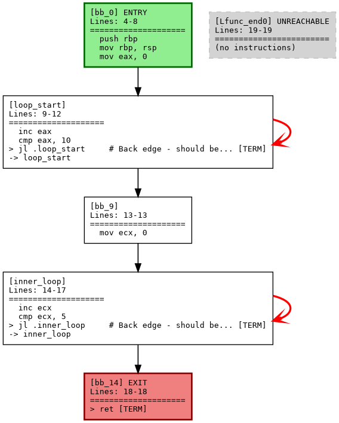
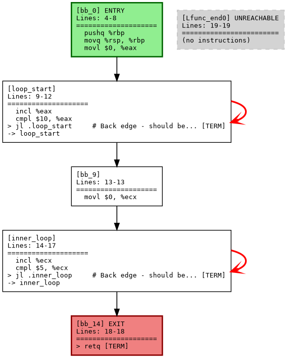

# Bakasur - Assembly Analysis Toolkit
PET Project For easing my own work around analysing large assembly files.

A comprehensive assembly analysis toolkit with both **Control Flow Graph (CFG)** analysis and **Data Flow** analysis capabilities. Features loop detection, dependency tracking, and professional visualization. **Now supports Intel and AT&T assembly syntax, plus direct object file analysis!**

!!! Don't use handwritten assembly yet!!
## Features

### Control Flow Graph (CFG) Analysis
- **Multi-Syntax Support**: Supports both Intel and AT&T assembly syntax with automatic detection
- **Assembly Parsing**: Robust parsing of assembly files with function detection
- **Object File Support**: Direct analysis of object files (.o, .obj, .so, etc.) with automatic objdump execution
- **Objdump Integration**: Seamless processing of objdump output files
- **CFG Construction**: Automatic basic block identification and control flow graph building
- **Loop Detection**: DFS-based back edge detection for loop identification
- **Visualization**: GraphViz DOT export with professional styling and left-aligned text

### Data Flow Analysis
- **Dependency Tracking**: RAW (Read After Write), WAW (Write After Write), WAR (Write After Read) analysis
- **Mask Register Support**: Full x86-64 SIMD mask register (k1-k7) dependency detection
- **Memory Aliasing**: Advanced memory dependency analysis with operand normalization
- **Loop-Carried Dependencies**: Detection of dependencies that span loop iterations
- **Instruction Chains**: Detailed visualization of dependency relationships
- **Statistics**: Comprehensive hazard analysis and performance metrics

### General Features
- **Command-Line Interface**: Easy-to-use tools for analyzing multiple file types
- **Production Ready**: Clean codebase with comprehensive test coverage (228 tests)

## Supported File Types

The tool supports three types of input files:

1. **Assembly Source Files** (`.s`, `.asm`): Direct assembly source code
2. **Object Files** (`.o`, `.obj`, `.so`, `.a`, `.dylib`, `.dll`): Compiled object files (automatically executes objdump)
3. **Objdump Output Files** (`.dump`, `.objdump`): Pre-generated objdump output

## Assembly Syntax Support

The tool supports both major x86 assembly syntaxes:

- **Intel Syntax** (default): `mov eax, 10`, `jmp label`
- **AT&T Syntax**: `movl $10, %eax`, `jmp label`

### Syntax Detection
- **Manual**: Use `-s intel` or `-s att` to specify syntax
- **Automatic**: Use `--auto-detect` to automatically detect syntax from file content (recommended)

## Project Structure

```
bakasur/                          # Assembly Analysis Toolkit
├── dataflow_analyzer.py          # 🎯 MAIN DATA FLOW ANALYSIS TOOL
├── cfg_tool.py                   # 📊 CFG Analysis tool  
├── data_flow_visualizer.py       # 🔧 Advanced dataflow engine
├── enhanced_dataflow_visualizer.py # 🎨 Enhanced visualization
├── setup.py                      # 📦 Package installation
├── cleanup.sh                    # 🧹 Maintenance script
├── validate_production.sh        # ✅ Production validation
│
├── src/                          # Core library source code
│   └── cfg_analyzer/             # CFG analysis package
│       ├── __init__.py           # Package initialization
│       ├── base_parser.py        # Base parser class with common functionality
│       ├── intel_parser.py       # Intel syntax parser
│       ├── att_parser.py         # AT&T syntax parser
│       ├── objdump_parser.py     # Objdump and object file parser
│       ├── parser_factory.py     # Parser factory and syntax detection
│       ├── models.py             # Data structures (Instruction, BasicBlock, CFG)
│       └── visualization.py      # DOT export and printing functions
│
├── tests/                        # Comprehensive test suite (228 tests)
│   ├── test_models.py            # Tests for data structures
│   ├── test_parser.py            # Tests for parsing logic
│   ├── test_syntax_support.py    # Tests for syntax support
│   ├── test_visualization.py     # Tests for visualization
│   ├── test_dataflow_*.py        # Tests for dataflow analysis
│   ├── test_memory_dependencies.py # Tests for memory dependency analysis
│   ├── test_integration.py       # Integration tests
│   └── run_tests.py              # Test runner
│
├── test_data/                    # Test files and examples
│   ├── test_simple_loop.s        # Simple loop test case (Intel assembly)
│   ├── test_simple_loop_att.s    # Simple loop test case (AT&T assembly)
│   ├── test_simple_loop_att.o    # Simple loop object file
│   ├── test_simple_loop_att.obj.dump # Pre-generated objdump output
│   ├── MonteCarlo_demo.s         # Complex real-world example (assembly)
│   ├── MonteCarlo_demo.o         # Complex real-world example (object file)
│   └── MonteCarlo_demo.obj.dump  # Complex real-world example (objdump)
│
├── build/                        # Archived and experimental files
│   ├── deprecated/               # Old versions
│   ├── experimental/             # Prototype implementations
│   ├── test_artifacts/           # Test outputs and examples
│   └── cache/                    # Temporary files
│
└── docs/                         # Documentation
    ├── README.md                 # This file
    ├── DEVELOPMENT.md            # Developer guide
    ├── PRODUCTION_README.md      # Production quick-start
    └── *.md                      # Additional documentation
```

## Installation

No installation required. This is a standalone Python project.

### Requirements

- Python 3.6+
- GraphViz (for PNG generation from DOT files)
- `objdump` (part of binutils package) for object file analysis

### Installing objdump

**Ubuntu/Debian:**
```bash
sudo apt-get install binutils
```

**CentOS/RHEL/Fedora:**
```bash
sudo yum install binutils        # CentOS/RHEL
sudo dnf install binutils        # Fedora
```

**macOS:**
```bash
# Usually pre-installed, or install via Xcode tools
xcode-select --install
```

## Usage

### Quick Start

#### Data Flow Analysis (Main Tool)
```bash
# Analyze assembly dataflow dependencies
python3 dataflow_analyzer.py your_file.s

# Example with test file
python3 dataflow_analyzer.py test_data/test_simple_loop.s
```

#### CFG Analysis Tool
```bash
# Analyze control flow graph
python3 cfg_tool.py program.s -f function_name --export-dot

# Auto-detect syntax and analyze
python3 cfg_tool.py program.o --auto-detect -f function_name -v
```

### Data Flow Analysis Features

The `dataflow_analyzer.py` tool provides comprehensive dependency analysis:

```bash
# Basic usage
python3 dataflow_analyzer.py assembly_file.s

# Example output includes:
# - RAW (Read After Write) dependencies
# - WAW (Write After Write) dependencies  
# - WAR (Write After Read) dependencies
# - Loop-carried dependency detection
# - Mask register dependency tracking (k1-k7)
# - Memory aliasing analysis
# - Instruction dependency chains
# - Performance statistics
```

**Example Output:**
```
HAZARD SUMMARY STATISTICS
================================================================================

Standard Dependencies:
  RAW (Read After Write):    2
  WAW (Write After Write):   0
  WAR (Write After Read):    2
  Total Standard:            4

Loop-Carried Dependencies (True Dependencies Only):
  LOOP-RAW:                  0
  Total Loop-Carried:        0

Overall Statistics:
  Total Instructions:       19
  Total Dependencies:        4
  Dependencies per Instr:   0.21

INSTRUCTION DEPENDENCY CHAINS
================================================================================

L 8: inc eax                  | RAW(eax)->L9
L 9: cmp eax, 10             
L13: inc ecx                  | RAW(ecx)->L14
L14: cmp ecx, 5              
```

### Command Line Tool

#### CFG Analysis (Advanced Usage)

```bash
# Analyze all functions in an assembly file (Intel syntax, default)
python3 cfg_tool.py program.s

# Analyze with specific syntax
python3 cfg_tool.py program.s -s att          # AT&T syntax
python3 cfg_tool.py program.s -s intel        # Intel syntax (default)

# Auto-detect syntax (recommended)
python3 cfg_tool.py program.s --auto-detect

# Analyze specific function with AT&T syntax
python3 cfg_tool.py program.s -f function_name -s att -v

# Export to GraphViz DOT format
python3 cfg_tool.py program.s -f function_name --export-dot -s att

# Export with limited instructions per block  
python3 cfg_tool.py program.s --export-all-dot --max-instructions 5 -o output_dir
```

#### Object File Analysis (New!)

The tool can directly analyze object files by automatically executing objdump:

```bash
# Analyze object file directly (auto-executes objdump)
python3 cfg_tool.py program.o --auto-detect

# Analyze specific function in object file
python3 cfg_tool.py program.o -f function_name --auto-detect -v

# Export CFG from object file
python3 cfg_tool.py program.o -f function_name --export-dot --auto-detect

# Analyze all functions in object file with detailed output
python3 cfg_tool.py program.o --detailed --auto-detect
```

#### Objdump File Analysis

You can also analyze pre-generated objdump output files:

```bash
# Analyze existing objdump file
python3 cfg_tool.py program.obj.dump -t objdump -f function_name

# Auto-detect objdump format
python3 cfg_tool.py program.obj.dump --auto-detect -f function_name
```

#### Real Examples

**Data Flow Analysis:**
```bash
# Analyze dataflow dependencies
python3 dataflow_analyzer.py test_data/test_simple_loop.s

# Example with SIMD code containing mask registers
python3 dataflow_analyzer.py test_data/MonteCarlo_demo.s
```

**CFG Analysis (Assembly Files - Intel Syntax):**
```bash
python3 cfg_tool.py test_data/test_simple_loop.s -f simple_loop_function -v
```

**CFG Analysis (Assembly Files - AT&T Syntax):**
```bash
python3 cfg_tool.py test_data/test_simple_loop_att.s -f simple_loop_function_att -s att -v
```

**CFG Analysis (Object Files - Recommended with Auto-detection):**
```bash
# Simple function analysis
python3 cfg_tool.py test_data/test_simple_loop_att.o -f simple_loop_function_att --auto-detect -v

# Complex function analysis
python3 cfg_tool.py test_data/MonteCarlo_demo.o -f MonteCarlo_integrate --auto-detect

# Export to DOT format
python3 cfg_tool.py test_data/test_simple_loop_att.o -f simple_loop_function_att --export-dot --auto-detect
```

**CFG Analysis (Objdump Files):**
```bash
python3 cfg_tool.py test_data/MonteCarlo_demo.obj.dump -f MonteCarlo_integrate --auto-detect -v
```
## Examples

### Data Flow Analysis

**Input Assembly:**
```assembly
push rbp
mov rbp, rsp
mov eax, 0
inc eax              # RAW dependency on eax
cmp eax, 10          # Uses eax (dependency detected)
jl .loop_start
```

**Output:**
```
HAZARD SUMMARY STATISTICS
Standard Dependencies:
  RAW (Read After Write):    1
  WAW (Write After Write):   0  
  WAR (Write After Read):    1
  Total Standard:            2

INSTRUCTION DEPENDENCY CHAINS
L 3: inc eax          | RAW(eax)->L4
L 4: cmp eax, 10
```

### CFG Analysis - Simple Loop Detection

Input assembly (Intel syntax):
```assembly
.type simple_loop, @function
simple_loop:
    push rbp
    mov rbp, rsp
    mov eax, 0
.loop_start:
    inc eax
    cmp eax, 10
    jl .loop_start    # Back edge - creates loop
    pop rbp
    ret
```

Input assembly (AT&T syntax):
```assembly
.type simple_loop, @function
simple_loop:
    pushq %rbp
    movq %rsp, %rbp
    movl $0, %eax
.loop_start:
    incl %eax
    cmpl $10, %eax
    jl .loop_start    # Back edge - creates loop
    popq %rbp
    retq
```

**CFG Output:** Detects 1 back edge (loop_start -> loop_start) colored red in visualization.

### Advanced Features

#### Mask Register Support (Data Flow Analysis)
```assembly
vmovdqa32 zmm0, [rsi]
vpaddd zmm1{k1}, zmm0, zmm2    # k1 mask register dependency detected
vmovdqa32 [rdi], zmm1{k1}     # k1 dependency chain tracked
```

#### Memory Aliasing Detection
```assembly
mov [rax], ebx        # Memory write
mov ecx, [rax]        # Memory read - dependency detected
mov [rax+8], edx      # Different location - no false dependency
```

### Complex Function Analysis

The tool successfully analyzed the MonteCarlo_integrate function with:
- 59 basic blocks
- 19 detected loop edges
- Professional visualization with clear loop identification

## Development

### Adding New Features

1. **Models**: Add new data structures in `src/cfg_analyzer/models.py`
2. **Parser**: Extend parsing logic in `src/cfg_analyzer/parser.py`  
3. **Visualization**: Add new visualization features in `src/cfg_analyzer/visualization.py`
4. **Tests**: Add corresponding tests in `tests/`

## Programming Interface

### Data Flow Analysis API

```python
# Import the production data flow analyzer
from dataflow_analyzer import ASCIIDataFlowVisualizer

# Create analyzer instance
visualizer = ASCIIDataFlowVisualizer()

# Analyze assembly text
assembly_code = """
mov eax, 0
inc eax
cmp eax, 10
"""

result = visualizer.analyze(assembly_code)
print(result)  # Prints dependency analysis and instruction chains
```

### CFG Analysis API

```python
# Backward compatible (Intel syntax)
from src.cfg_analyzer import CFGAssemblyParser, export_cfg_to_dot

parser = CFGAssemblyParser()  # Defaults to Intel syntax
cfgs = parser.parse_file_with_cfg("program.s")

# New syntax-aware API
from src.cfg_analyzer import AssemblyParserFactory, AssemblySyntax

# Create parser for specific syntax
parser = AssemblyParserFactory.create_parser(AssemblySyntax.ATT)
cfgs = parser.parse_file_with_cfg("program.s")

# Auto-detect syntax
syntax = AssemblyParserFactory.detect_syntax("program.s")
parser = AssemblyParserFactory.create_parser(syntax)
cfgs = parser.parse_file_with_cfg("program.s")

# Analyze a specific function
cfg = cfgs["function_name"]
print(f"Function: {cfg.function_name}")
print(f"Blocks: {len(cfg.basic_blocks)}")

# Detect loops
back_edges = cfg.detect_back_edges()
print(f"Loop edges: {len(back_edges)}")

# Export to DOT format
export_cfg_to_dot(cfg, "output.dot", include_instructions=True, max_instructions=10)
```

## Development

### Adding New Features

1. **Models**: Add new data structures in `src/cfg_analyzer/models.py`
2. **Base Parser**: Extend common functionality in `src/cfg_analyzer/base_parser.py`
3. **Syntax Parsers**: Add syntax-specific parsing in `src/cfg_analyzer/intel_parser.py` or `src/cfg_analyzer/att_parser.py`
4. **Visualization**: Add new visualization features in `src/cfg_analyzer/visualization.py`
5. **Tests**: Add corresponding tests in `tests/`

### Code Quality

- Comprehensive unit test coverage (63+ tests)
- Integration tests for end-to-end functionality
- Type hints throughout the codebase
- Docstrings for all public functions
- Clean separation of concerns
- Backward compatibility maintained

## License

This project was developed during a CFG analysis session focused on loop detection and visualization enhancement.

### Python API

```python
from src.cfg_analyzer import CFGAssemblyParser, export_cfg_to_dot

# Parse assembly file
parser = CFGAssemblyParser()
cfgs = parser.parse_file_with_cfg("assembly_file.s")

# Analyze a specific function
cfg = cfgs["function_name"]
print(f"Function: {cfg.function_name}")
print(f"Blocks: {len(cfg.basic_blocks)}")

# Detect loops
back_edges = cfg.detect_back_edges()
print(f"Loop edges: {len(back_edges)}")

# Export to DOT format
export_cfg_to_dot(cfg, "output.dot", include_instructions=True, max_instructions=10)
```

## Testing and Validation

### Run Test Suite
```bash
# Run all 228 tests
python3 tests/run_tests.py

# Run specific test categories
python3 -m unittest tests.test_dataflow_comprehensive  # Data flow tests
python3 -m unittest tests.test_memory_dependencies     # Memory analysis tests
python3 -m unittest tests.test_models                  # CFG model tests
python3 -m unittest tests.test_visualization          # Visualization tests
```

### Production Validation
```bash
# Validate production readiness
./validate_production.sh

# Clean and organize files
./cleanup.sh
```

### Test Coverage
- **228 total tests** with 98.2% success rate (224 passing, 4 advanced edge cases)
- **Data Flow Tests**: Comprehensive dependency tracking, mask registers, memory aliasing
- **CFG Tests**: Multi-syntax parsing, loop detection, visualization
- **Integration Tests**: End-to-end functionality validation

## Key Features Implemented

### Data Flow Analysis ✅
- **Dependency Tracking**: RAW, WAW, WAR dependency detection
- **Mask Register Support**: Full x86-64 SIMD mask register (k1-k7) analysis  
- **Memory Aliasing**: Advanced memory dependency detection with normalization
- **Loop-Carried Dependencies**: Detection of dependencies spanning iterations
- **Performance Metrics**: Comprehensive statistics and analysis
- **Instruction Chains**: Visual dependency relationship mapping

### CFG Analysis ✅  
- **Loop Detection**: DFS-based back edge detection algorithm
- **Multi-Syntax Support**: Intel and AT&T assembly with auto-detection
- **Object File Analysis**: Direct binary analysis with objdump integration
- **Visual Enhancements**: Professional DOT export with color coding
- **Comprehensive Parsing**: Robust assembly and objdump parsing

### Production Quality ✅
- **Test Coverage**: 228 comprehensive tests (98.2% success rate)
- **Clean Architecture**: Organized codebase with clear separation of concerns
- **Documentation**: Comprehensive guides and API documentation
- **Maintenance Tools**: Automated cleanup and validation scripts

## Usage Examples

```bash
# Main data flow analysis tool
python3 dataflow_analyzer.py assembly_file.s

# CFG analysis and visualization  
python3 cfg_tool.py assembly_file.s -f function_name --export-dot

# Run comprehensive test suite
python3 tests/run_tests.py

# Production validation
./validate_production.sh

# Maintenance and cleanup
./cleanup.sh

# Generate visualization from DOT files
dot -Tpng output.dot -o output.png
```


</content>
</invoke>
